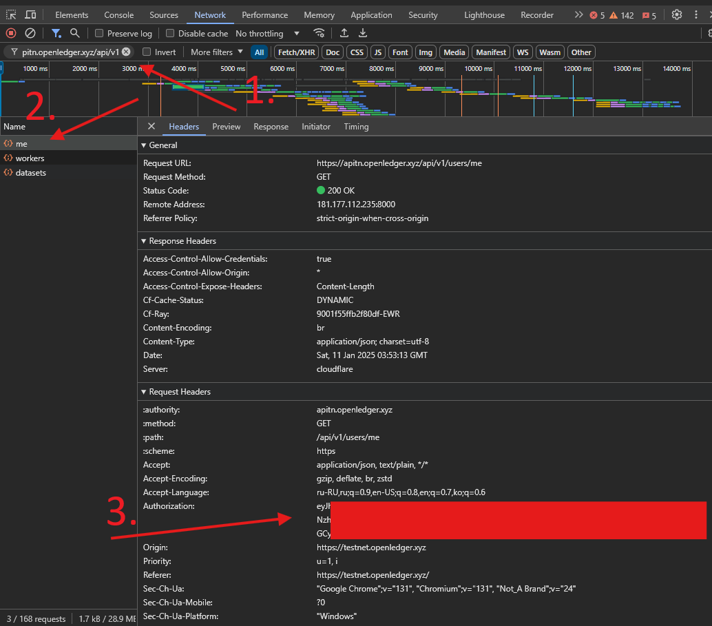

## Openledger

##### This bot works like extension.
Made by https://t.me/glistdao

##### Features:
- Only farm

## Install

Install [python 3.12](https://www.python.org/downloads/release/python-3120/)


Linux:
```shell
python3.12 -m venv venv && \
. ./venv/bin/activate && \
pip install -r requirements.txt
```

Windows
```powershell
python -m venv venv
. .\venv\Scripts\activate
pip install -r .\requirements.txt
```

Provide your token in `config.toml`. You can get it in https://testnet.openledger.xyz,
from F12 -> Network

Paste in "Search" apitn.openledger.xyz/api/v1, open `me` or another XHR request and copy `Authorization` header value.



```toml
# config.toml

token = "your token"
```


#### Proxies

You can comment `proxies_path` line in `config.toml` to disable proxies.
Or you can provide one proxy in `proxies.txt` in format `http://username:password@ip:port`.
I don't recommend to provide many proxies because of openledger API is unstable and you can load it heavily, causing the API to crash

```toml
# config.toml

# comment this line if you don't want to use proxies
proxies_path = "proxies.txt"
```

#### Run

Linux:
```shell
python -m src
```

Windows:
```powershell
python -m src
```
